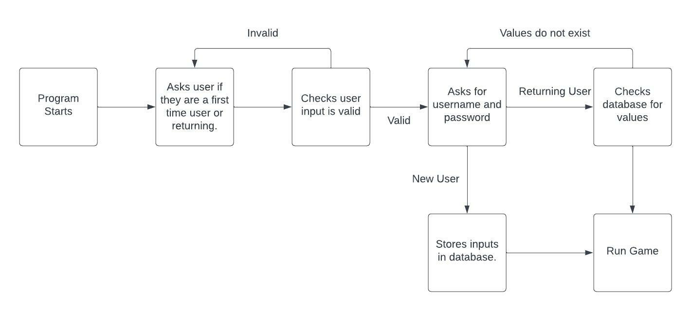

# Battleships

Battleships is a game of logic, with players attempting to sink each others fleet by guessing co-ordinates.
This version uses a a board generated using Python lists and incorporates a logic engine to allow the computer to fire back at the user.

(Developer: Stuart Wall)

[Live webpage](https://ci-pp3-battleships-clinelly.herokuapp.com/)

## Table of Content

1. [Project Goals](#project-goals)
    1. [User Goals](#user-goals)
    2. [Site Owner Goals](#site-owner-goals)
2. [User Experience](#user-experience)
    1. [Target Audience](#target-audience)
    2. [User Requirements and Expectations](#user-requirements-and-expectations)
    3. [User Stories](#user-stories)
3. [Technical Design](#technical-design)
    1. [Flowchart](#flowchart)
4. [Technologies Used](#technologies-used)
    1. [Languages](#languages)
    2. [Frameworks & Tools](#frameworks-&-tools)
5. [Features](#features)
6. [Testing](#validation)
    1. [PEP8 validation](#pep8-validation)
    2. [Testing user stories](#testing-user-stories)
8. [Bugs](#Bugs)
9. [Deployment](#deployment)
10. [Credits](#credits)
11. [Acknowledgments](#acknowledgments)

## Project Goals 
The project goal is to create a logic game using Python.

### User Goals

The application user wants to play a logic game.

### Site Owner Goals
The Battleships game is played on grids on which each player's fleet of battleships are marked. The locations of the fleets are concealed from the other player. Players call shots at the other player's ships, and the objective of the game is to destroy the opposing player's fleet.
The application provides a working battleships game for a single user to play against the computer.

## User Experience

### Target Audience
- Younger users who like playing games.
- Users who are looking for a game to pass time on during a break.
- Older users who are looking for a logic challenge.

### User Requirements and Expectations

### User Stories
1. To create a personal username.
2. To be able to return to the game with my username and password.
3. To have an immersive experience.
4. To have real-time feedback when playing the game.
5. To be able to play the game against a computer opponent.
6. To be told when the game has been won or lost.
7. To be able to easily replay the game if wanted.

## Technical Design

### Flowchart

Login

Game

## Technologies Used

### Languages
- Python 3

### Frameworks & Tools
- LucidChart
- Heroku
- Google Drive
- Google Spreadsheet
- gitHub
- Gitpod
- Git

## Features

### Welcome Message
- Shows a welcome message and an ASCII art warship.

## Validation

### PEP8 validation
At the time of creation, the PEP8 online Python validation website was inoperative. To validate the code, a PEP8 validator that is built into the GitPod Workspace was used.

1. Run the command 'pip3 install pycodestyle'. (Note that this extension may already be installed, in which case this command will do nothing.)
2. In the workspace, press Ctrl+Shift+P (or Cmd+Shift+P on Mac).
3. Type the word 'linter' into the search bar that appears. 
4. Click on 'Python: Select Linter' from the filtered results.
5. Select 'pycodestyle' from the list.
6. PEP8 errors will now be underlined in red, as well as being listed in the PROBLEMS tab beside the terminal.

### Testing user stories

1. 

| **Feature** | **Action** | **Expected Result** | **Actual Result** |
|-------------|------------|---------------------|-------------------|

## Bugs

| **Bug** | **Fix** |
| ----------- | ----------- |
| New and Old User functions activated twice. | Moved the function calls to the Login function if/elif statements. |
| Missile counter decreased by two each round. | Seperated missile variable into two; one for the user and computer. |
| Check Login function would not validate user input. | Changed syntax of the Login function if/elif statements. |

## Deployment
The website was deployed using Heroku by "following these steps:
1. Use the "pip freeze -> requiremnts.txt" command in the terminal to save any libraries that need to be instaled in the file
2. Login or create a Heroku account
3. Click the "new" button in the upper right corner and select "create new app"
4. Choose an app name and your region and click "Create app"
5. Go to the "settings" tab, add the python build pack and then the node.js build pack
6. Go to the "deploy" tab and pick GitHub as a deployment method
7. Search for a repository to connect to
8. Click enable automatic deploys and then deploy branch
9. Wait for the app to build and then click on the "View" link

You can fork the repository by following these steps:
1. Go to the GitHub repository
2. Click on the Fork button in the upper right-hand corner

You can clone the repository by following these steps:
1. Go to the GitHub repository 
2. Locate the Code button above the list of files and click it 
3. Select if you prefer to clone using HTTPS, SSH, or Github CLI and click the copy button to copy the URL to your clipboard
4. Open Git Bash
5. Change the current working directory to the one where you want the cloned directory
6. Type git clone and paste the URL from the clipboard ($ git clone https://github.com/YOUR-USERNAME/YOUR-REPOSITORY)
7. Press Enter to create your local clone.

## Credits

### Media
- ASCII art:

### Code

## Acknowledgments
I would like to take the opportunity to thank:
- My mentor Mo Shami for his feedback, advice, guidance and support.
